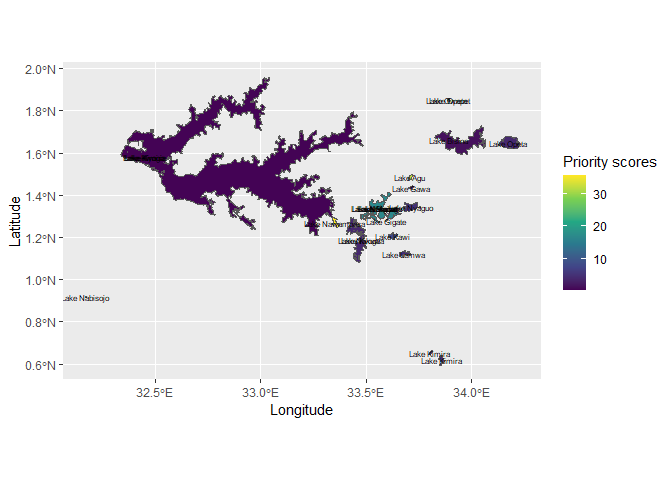
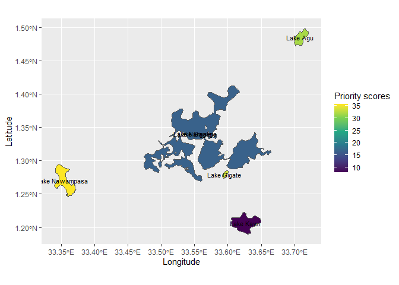

<!-- README.md is generated from README.Rmd. Please edit that file -->

# conspriorityr

<!-- badges: start -->

[](https://github.com/AnthonyBasooma/conspriorityr/actions/workflows/R-CMD-check.yaml)
<!-- badges: end -->

# Introduction

Funding biodiversity conservation strategies are usually minimal, thus
prioritizing habitats at high risk should be conducted. We developed and
tested a conservation priority index (CPI) that ranks habitats to aid in
prioritizing them for conservation. We tested the index using 1897 fish
species from 273 African inland lakes and 34 countries. In the index,
lake surface area, rarity, and their International Union for
Conservation of Nature (IUCN) Red List status were incorporated. We
retrieved data from the Global Biodiversity Information Facility (GBIF)
and IUCN data repositories. Lake Nyasa had the highest species richness
(424), followed by Tanganyika (391), Nokoué (246), Victoria (216), and
Ahémé (216). However, lakes Otjikoto and Giunas had the highest CPI of
137.2 and 52.1, respectively. Lakes were grouped into high priority (CPI
\> 0.5; n = 56) and low priority (CPI \< 0.5; n = 217). The median
surface area between priority classes was significantly different (W =
11,768, p \< .05, effect size = 0.65). Prediction accuracy of Random
Forest (RF) and eXtreme Gradient Boosting (XGBoost) for priority classes
were 0.912 and 0.954, respectively. Both models exhibited lake surface
area as the variable with the highest importance. CPI generally
increased with a decrease in lake surface area. This was attributed to
less ecological substitutability and higher exposure levels of
anthropogenic stressors such as pollution to a species in smaller lakes.
Also, the highest species richness per unit area was recorded for
high-priority lakes. Thus, smaller habitats or lakes may be prioritized
for conservation although larger waterbodies or habitats should not be
ignored. The index can be customized to local, regional, and
international scales as well as marine and terrestrial habitats.
<https://doi.org/10.1002/ece3.8762>.

## Installation

Install the recent version from Github

``` r
#For windows operating system
#
install.packages('remotes)

install_github("AnthonyBasooma/conspriorityr")
library(conspriorityr)
```

``` r
#Mac
remotes::install_github("AnthonyBasooma/conspriorityr@HEAD")
library(conspriorityr)
```

# Usage

## Conservation prioritsation vs financial constraints

## Example: Prioritizing the conservation of a waterbody with conservation significance but with limited resources in the Lake Kyoga system in Uganda

``` r

library(conspriorityr) #compute priority scores
library(sf) #to handle the vector data/maps
#> Warning: package 'sf' was built under R version 4.3.1
#> Linking to GEOS 3.11.2, GDAL 3.6.2, PROJ 9.2.0; sf_use_s2() is TRUE
library(dplyr)
#> Warning: package 'dplyr' was built under R version 4.3.1
#> 
#> Attaching package: 'dplyr'
#> The following objects are masked from 'package:stats':
#> 
#>     filter, lag
#> The following objects are masked from 'package:base':
#> 
#>     intersect, setdiff, setequal, union
library(ggplot2)
#> Warning: package 'ggplot2' was built under R version 4.3.1
```

## Data sources

``` r

#Obtain hydrosheds basins for Africa and extract the Kyoga lakes system
#https://data.hydrosheds.org/file/hydrobasins/standard/hybas_af_lev01-12_v1c.zip
#Kyoga lakes extracted for analysis

kyoga <- st_read(dsn=system.file('extdata/hydrosheds', 'kyoga.shp', 
                                 package = 'conspriorityr'), quiet = TRUE)


#Species occurences archived in the package
data('gbif')
species_occurences <- gbif
```

\##Data cleaning and merging

``` r

#Remove any NAs in the latitudes/longitudes
species_clean <- species_occurences[complete.cases(species_occurences$decimalLatitude),]

#Convert to sf data format

species_clean_sf <- species_clean %>% st_as_sf(coords = c('decimalLongitude','decimalLatitude'), crs=st_crs(4326))

head(species_clean_sf)
#> Simple feature collection with 6 features and 9 fields
#> Geometry type: POINT
#> Dimension:     XY
#> Bounding box:  xmin: 33.19396 ymin: 0.406958 xmax: 33.20008 ymax: 0.407362
#> Geodetic CRS:  WGS 84
#>                   species iucnstatus type IndCount                 locality
#> 1      Haplochromis mbipi         LC Lake       10 SON Cage site-Downstream
#> 2      Haplochromis mbipi         LC Lake       11   SON Cage site-Upstream
#> 3  Haplochromis victoriae         DD Lake        2   SON Cage site-Upstream
#> 4 Haplochromis riponianus         LC Lake       18   SON Cage site-Upstream
#> 5   Haplochromis barbarae         CE Lake        1   SON Cage site-Upstream
#> 6 Haplochromis riponianus         LC Lake        1 SON Cage site-Downstream
#>        SampleP     waterbody    category surfacearea                  geometry
#> 1 Gill netting Lake Victoria Major Lakes       33700 POINT (33.19396 0.407362)
#> 2 Gill netting Lake Victoria Major Lakes       33700 POINT (33.20008 0.406958)
#> 3 Gill netting Lake Victoria Major Lakes       33700 POINT (33.20008 0.406958)
#> 4 Gill netting Lake Victoria Major Lakes       33700 POINT (33.20008 0.406958)
#> 5 Gill netting Lake Victoria Major Lakes       33700 POINT (33.20008 0.406958)
#> 6 Gill netting Lake Victoria Major Lakes       33700 POINT (33.19396 0.407362)

#Filter out records within the kyoga lakes
species_clean_kyoga <- sf:: st_filter(species_clean_sf, kyoga) 

#clean habitat names
```

## Testing functionalites

## Rarity ranges from 0 : Present in all habitats to 1: found in only one system

``` r

#Rarity of Haplochromis avium in the Kyoga system

haplo_rare <- rarity(data = species_clean_kyoga%>% st_drop_geometry(), habitat = 'waterbody',species = 'species',
              sp = 'Haplochromis squamulatus')

haplo_rare
#> [1] 0.8888889

#Conservation priority score for Kyoga main
kyogamain <- rareend(data = species_clean_kyoga%>% st_drop_geometry(), habitat = 'waterbody', species = 'species',
                 area = 'surfacearea',iucn = 'iucnstatus',
                 hname = 'Lake Kyoga')
kyogamain
#> [1] 0.3888523
# #CPI for Agu

agu <- rareend(data = species_clean_kyoga %>% st_drop_geometry(), habitat = 'waterbody', species = 'species',
                 area = 'surfacearea',iucn = 'iucnstatus',
                 hname = 'Lake Agu')
agu
#> [1] 31.71759

#CPI Agu 31.717 vs 0.38: Which signifies that in case of less resources Lake Agu should be prioritised for conservation due to number of threatened and endemic species per unit surface area
```

## Compute for many waterbodies or habitats

``` r
cpiall <- cpi(data = species_clean_kyoga%>% st_drop_geometry(), habitat = 'waterbody',
             species='species', area = 'surfacearea', iucn = 'iucnstatus')
#> No Nas


## Considering polygons for visualization

#Merge polygon data with species occurences 

species_clean_kyogapoly <- sf::st_join(kyoga, species_clean_kyoga)#%>% st_drop_geometry()


#Compute priority scores for Lake Agu

cpiagu_poly <- rareend(data = species_clean_kyogapoly%>% st_drop_geometry(), habitat = 'waterbody',
                  species = 'species', area = 'surfacearea', iucn = 'iucnstatus',
                  hname = 'Lake Agu')
#> Missing values found in species_clean_kyogapoly %>% st_drop_geometry() and removed

#Compute for all waterbodies 

cpipol<- cpi(data = species_clean_kyogapoly%>% st_drop_geometry(), 
             habitat = 'waterbody',
             species='species', area = 'surfacearea', iucn = 'iucnstatus')
#> Missing values found in species_clean_kyogapoly %>% st_drop_geometry() and removed
```

## Visualization

``` r

cpipol1 <- cpipol %>% rename(waterbody =sites)

cpipolmap <- merge(species_clean_kyogapoly, y=cpipol1, by="waterbody", all.x=F) %>%
  dplyr::select(cpi, waterbody)


finalresult <- unique.data.frame(cpipolmap)

#All waterbodies 

ggplot()+
  geom_sf(data= finalresult, aes(fill=cpi))+
  scale_fill_viridis_c(direction = 1)+
  geom_sf_text(data = finalresult, aes(label = waterbody), size=4)
#> Warning in st_point_on_surface.sfc(sf::st_zm(x)): st_point_on_surface may not
#> give correct results for longitude/latitude data
```



``` r

#Only five with high scores
ggplot()+
  geom_sf(data= finalresult %>% filter(cpi>5), aes(fill=cpi))+
  scale_fill_viridis_c(direction = 1)+
  geom_sf_text(data = finalresult %>% filter(cpi>5), aes(label = waterbody), size=4)
#> Warning in st_point_on_surface.sfc(sf::st_zm(x)): st_point_on_surface may not
#> give correct results for longitude/latitude data
```


